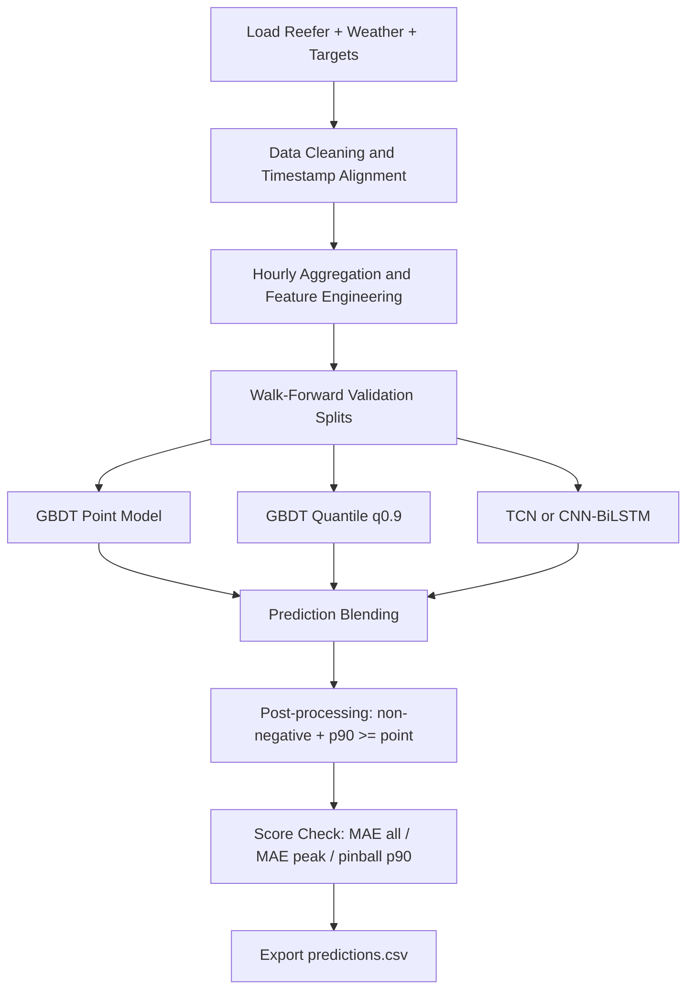
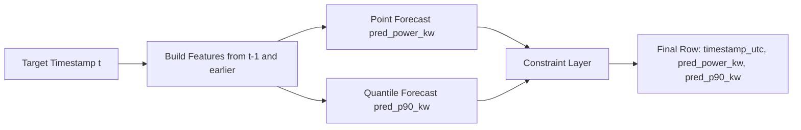
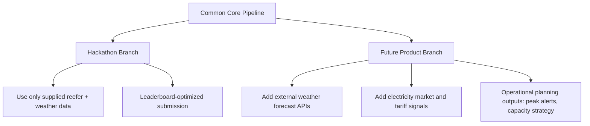

# Reefer Forecasting Architecture Planning

## 1) Problem Framing

Forecast hourly reefer terminal demand 24h ahead for each target timestamp:

- Output A: `pred_power_kw` (best estimate)
- Output B: `pred_p90_kw` (upper-risk estimate)

Optimization target follows challenge scoring:

- all-hour accuracy
- peak-hour accuracy
- quality of p90 quantile estimate

## 2) Inputs and Feature Interfaces

### Core Inputs (Officially Allowed)

1. Reefer operational history (`reefer_release.csv`)
2. Weather history from provided weather files
3. Target horizon timestamps (`target_timestamps.csv`)

### Feature Groups

- **Temporal**: hour-of-day, day-of-week, cyclic encodings, weekend flag
- **Load lags**: `lag_1 ... lag_168`, rolling means/max/std
- **Container dynamics**:
  - active reefer count
  - hardware type composition
  - setpoint/ambient/return/supply aggregates
  - location/rack distribution proxies
- **Weather dynamics**:
  - wind speed, direction, temperature at multiple sensors
  - lagged weather and interaction terms with recent load

### Strict Leakage Policy

At prediction time for hour `t`, every feature must be derived only from `<= t-1h` information.

## 3) Output Design

### Required Submission Schema

- `timestamp_utc`
- `pred_power_kw`
- `pred_p90_kw`

### Output Constraints

- numeric and non-negative
- one row per target timestamp
- `pred_p90_kw >= pred_power_kw`

### Operationally Useful Add-ons (internal only)

- interval width: `pred_p90_kw - pred_power_kw`
- peak risk flag based on p90 threshold crossings

## 4) Model Strategy

## Primary Recommendation for 24h Hackathon

Use a **stacked ensemble**:

1. **GBDT Point Model** (LightGBM/CatBoost)
2. **GBDT Quantile Model** (q=0.9)
3. **Sequence Model** (TCN or CNN-BiLSTM)
4. Blend by validation-score optimized weights

Why this works:

- strong tabular + lag handling
- fast training and iteration
- robust on sparse/noisy industrial telemetry
- direct quantile support for p90

## CNN-BiLSTM vs Newer Models

- **CNN-BiLSTM**: still useful for local temporal motif extraction; good secondary model.
- **TCN**: often simpler and faster than BiLSTM with competitive temporal performance.
- **PatchTST**: strong modern transformer baseline for multivariate long contexts.
- **Chronos-Bolt / TimesFM class models**: high-quality zero-shot or light-tuning benchmarks; good accelerator when time is short and compute is available.

For this 24h setting, prioritize:

1. GBDT + TCN/CNN-BiLSTM (core)
2. Add one foundation-model benchmark only if pipeline is already stable

## 5) 2026-Era Model Notes (Web-validated options)

The following are practical forecasting options to test quickly in 2026 environments:

- Amazon Chronos family (including Chronos-Bolt) via AutoGluon/Hugging Face
- Google TimesFM (open repo + cloud integrations)
- PatchTST as open deep baseline

Reference links:

- [Chronos forecasting repository](https://github.com/amazon-science/chronos-forecasting)
- [AWS Chronos-Bolt blog](https://aws.amazon.com/blogs/machine-learning/fast-and-accurate-zero-shot-forecasting-with-chronos-bolt-and-autogluon/)
- [Google TimesFM repository](https://github.com/google-research/timesfm)
- [TimesFM research blog](https://research.google/blog/a-decoder-only-foundation-model-for-time-series-forecasting/)
- [PatchTST paper](https://arxiv.org/abs/2211.14730)

## 6) External Data: Should We Use It?

## Official Hackathon Submission

No. The challenge rules state to use only supplied files. External datasets can risk disqualification.

## Future Productization Branch (Recommended)

Yes. For the company's longer-term planning goals (capacity, positioning, energy optimization), create a separate R&D stream using:

- external weather forecasts/reanalysis (hourly, high-resolution)
- electricity economics (day-ahead prices, tariff periods, carbon intensity)
- vessel ETA and terminal congestion signals

This improves strategic planning without violating hackathon rules for leaderboard scoring.

## 7) GCP Architecture

### Minimal 24h Architecture (Fast)

- Vertex AI Workbench notebook for feature engineering and training
- Cloud Storage for datasets/artifacts
- One inference notebook/script producing `predictions.csv`

### Production-Ready Extension

- Data ingestion jobs -> feature table (BigQuery)
- Scheduled retraining (Vertex Pipelines)
- Batch scoring daily for next 24h horizon
- Monitoring drift and peak-hour error separately

## 8) Validation and Optimization Logic

- Walk-forward time splits (no random split)
- Track:
  - MAE all hours
  - MAE top-load hours
  - pinball loss at q=0.9
- Tune blend weights for challenge composite score
- Calibrate p90 with residual quantiles by context bucket (hour/weekday/load regime)

## 9) Flowcharts

## End-to-End Pipeline

## Feature and Inference Path

## Hackathon vs Future Branch

## 10) Recommended Final Stack for This Team

If the team has one day and GCP access:

1. Baseline + robust feature pipeline in first 4-6 hours
2. LightGBM/CatBoost point + q90 models as primary submission engine
3. Add TCN (or CNN-BiLSTM) as second learner and blend
4. Use foundation model (Chronos/TimesFM class) only as benchmark or blend booster if stable
5. Keep external-data integration as a clearly separated post-hackathon extension
